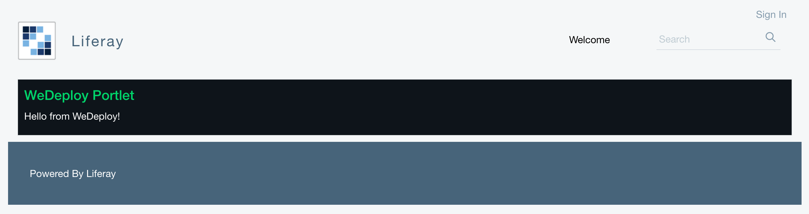

# WeDeploy sample Portlet

This a WeDeploy sample Portlet, created to demonstrate how to deploy Liferay applications to the Liferay service on WeDeploy.

## Configuring for WeDeploy

To generate the WeDeploy configuration files please execute:

```shell
# Generates the configuration files (container.json)
./gradlew clean configureWedeploy
```

It will create the `container.json` file with the following entries:

- id: The public identificator of the service. Default value is `liferay`.
- type: The image type that will generate the Liferay service. Default value is `wedeploy/liferay:bet`
- hooks: The build hook is added to perform a build inside
- storage: The volume that will be persisted between redeployments of the same service. Default value is LIFERAY_HOME directory, `/usr/local/liferay-ce-portal-7.0-ga4`.

## Deploying to Liferay

After generating the configuration files, commit them into your git repository, and execute the WeDeploy CLI:

```
# Creates the services on WeDeploy
we deploy
```

The project will be created in WeDeploy, with the application running there for you!

